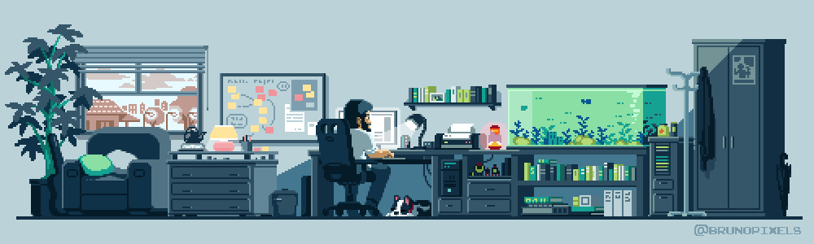

  

<h1 align="center"><b>GYANDEEP DEHINGIA</b></h1>
<h3 align="center">BCA grad <i>23-26</i> | Aspiring Full-Stack & DevOps</h3>

  Focused on mastering web development fundamentals, building efficient digital systems, and balancing deep-tech logic with visual creativity. 

  
  

  <!-- The Snake Animation -->
  <picture>
    <source media="(prefers-color-scheme: dark)" srcset="https://raw.githubusercontent.com/Gyandeep09/Gyandeep09/output/github-contribution-grid-snake-dark.svg">
    <source media="(prefers-color-scheme: light)" srcset="https://raw.githubusercontent.com/Gyandeep09/Gyandeep09/output/github-contribution-grid-snake.svg">
    
  </picture>

---

### 🚀 Current Focus
* 🔭 I’m currently working on a responsive 3D Simulator using **React** and **Next.js.**
* 🌱 I’m currently learning advanced architectural design patterns to build highly scalable **RESTful APIs.**
* 👯 I’m looking to collaborate on open-source **Full-Stack Web Applications** and high-fidelity interactive UI projects.
* ⚡ **Fun fact**: I balance my deep-tech logic with visual creativity, which is why I love mixing **Next.js** with **GSAP** animation.

---

###  Core Technical Stack

  
<b>⚙️(▀̿Ĺ̯▀̿ ̿)</b>

   
  
  **Languages & Frameworks**
  

    
  

  **Databases, Tools & Animation**
  

    
  

---

### 📌 Production Work

**Institutional Admission Portal** *(Private)*
* Developed a complete full-stack bilingual database management system for a regional high school.
* Engineered secure user authentication, registration workflows, and automated notification piping.
* **Stack:** `PHP` · `MySQL` · `Vanilla JS`

---

  

