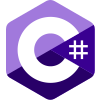
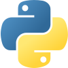
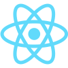
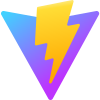

  

<h1 align="center"><b>GYANDEEP DEHINGIA</b></h1>
<h3 align="center">BCA grad <i>23-26</i> | Aspiring Full-Stack & DevOps</h3>

  Focused on mastering web development fundamentals, building efficient digital systems, 
   and balancing deep-tech logic with visual creativity. 
   
  
  
  
  
  

  
  &nbsp;&nbsp;&nbsp;&nbsp;
  
  &nbsp;&nbsp;&nbsp;&nbsp;
  
  &nbsp;&nbsp;&nbsp;&nbsp;
  

---

###  Current Focus

-  I’m currently working on a responsive 3D Simulator using **React** and **Next.js.**
-  I’m currently learning advanced architectural design patterns to build highly scalable **RESTful APIs.**
-  I’m looking to collaborate on open-source **Full-Stack Web Applications** and high-fidelity interactive UI projects.
-  **Fun fact**: I balance my deep-tech logic with visual creativity, which is why I love mixing **Next.js** with **GSAP** animation.

---

###  Core Technical Stack

  
<b>(▀̿Ĺ̯▀̿ ̿)</b>

   
  
  **Languages & Frameworks**
  

    
    
    
    
    
    
    
    
    
    
    
    
    
    
  

**Databases, Tools & Animation**

  

    
    
    
    
    
    
    
    
    
    
    
    
    
    
    
  

---

###  Production Work

**Institutional Admission Portal** _(Private)_

- Developed a complete full-stack bilingual database management system for a regional high school.
- Engineered secure user authentication, registration workflows, and automated notification piping.
- **Stack:** `PHP` · `MySQL` · `Vanilla JS`

---
